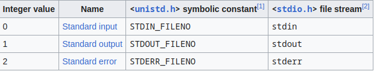

# **FILE Input/Output**

## **File Descriptor**

In Unix and Unix-Like computer operating systems a file descriptor (FD, less frequently flides) is a process-unique identifier (handle) for a file or other input/ output resource, such as a pipe or network socket.

File descriptors have a non-negative integer values being reserved to indicate "no value" or error conditions.

File descriptors are a part of the POSIX API. Each Unix process (except perhaps daemons) should have three standard POSIX file descriptors, corresponding to the three standard streams:

